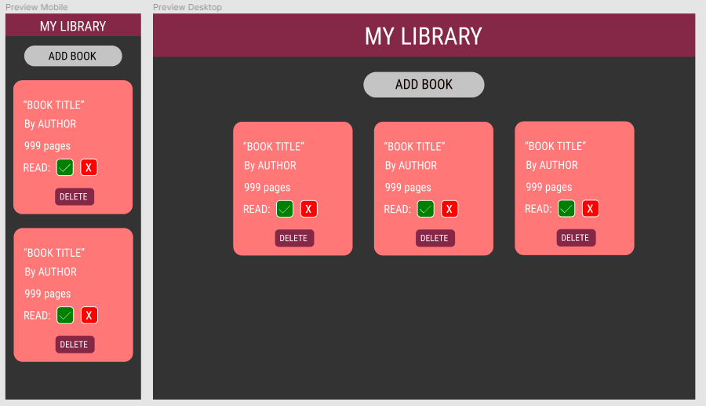

# Library

## Table of contents

- [Overview](#overview)
  - [The challenge](#the-challenge)
  - [Screenshot](#screenshot)
  - [Links](#links)
- [My process](#my-process)
  - [Built with](#built-with)
  - [What I learned](#what-i-learned)
- [Author](#author)

## Overview

### The challenge

Users should be able to:

- Add and delete books to the library.
- Update the read status of each book added.

### Screenshot

### Links

- [Live Site](https://my-library-odin.netlify.app)

## My process

### Built with

- Semantic HTML5 markup
- SASS for handling the CSS properties
- Flexbox
- Javascript using classes and a OOP approach

### What I learned

Working with classes in Javascript was a really good challenge. Although it seemed daunting at first, after some flowcharts made by pen and paper it became a really comfortable and straightforward way to create the library. I realized why OOP became so popular and important in the industry.

## Author

- Frontend Mentor - [@dnewbie25](https://www.frontendmentor.io/profile/dnewbie25)
- DevChallenges - [dnewbie25](https://devchallenges.io/portfolio/dnewbie25)